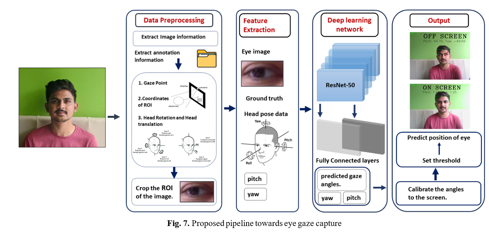
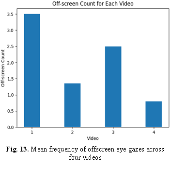
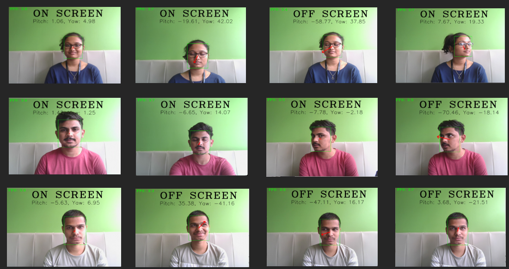

#EyeGaze tracking

Eye-tracking is a method that involves monitoring the position and movement of eyes that can help towards wide variety of applications.
We use L2CS-Net, a novel gaze estimation architecture built on ResNet-50. The model, is validated on the MPII Gaze dataset through 5-fold cross-validation and exhibited consistent reduction in combined loss during training.
The performance of the model is demonstrated for an application of profiling the attention of the user and monitoring the off-screen glances of the user while watching a video. 

## ***Pipeline of the Model***

<p align="center">
  
</p>


_**Data Pre-processing**_

- MPIIGaze Dataset can be downloaded from [here](https://www.mpi-inf.mpg.de/departments/computer-vision-and-machine-learning/research/gaze-based-human-computer-interaction/its-written-all-over-your-face-full-face-appearance-based-gaze-estimation)
  
- Pre-processing is vital for standardization and normalization of data, ensuring efficient feature learning.

- MPIIGaze data is been preprocessed as given [here](https://phi-ai.buaa.edu.cn/Gazehub/3D-dataset/).

_**train.py**_

Use the following script to train the MPIIGaze dataset:

```bash
python train1.py --dataset mpiigaze --gpu 0 --num_epochs 20 --batch_size 4 --lr 0.00001 --alpha 1
```

_**test.py**_

Use the following script to test the MPIIGaze dataset:

```bash
python test.py --dataset mpiigaze --snapshot output/snapshots/snapshot_folder --evalpath evaluation/L2CS-mpiigaze  --gpu 0
```

# Attention Profiling

In our project, we employ attention profiling using the above model to analyze viewer engagement with videos. The model tracks viewer behavior by monitoring the frequency and duration of off-screen instances while watching a particular video. By keeping a count of how many times a viewer diverts their attention away from the screen, we gain valuable insights into their level of engagement and focus. The demonstration video is shown in results section.

Test results assessing the viewer's attention across four distinct videos.

<p align="center">
  
</p>


# _**Results**_

<p align="center">
  
</p>

  ---

# Dataset Generated

### Dataset description
The dataset comprises 336 images, each measuring 640 by 480 pixels, all obtained with participants' consent. These images capture participants looking in eight distinct directions, as illustrated in the accompanying figure. The dataset thus represents a diverse set of visual stimuli, offering a comprehensive view of participants' gaze orientations across the specified eight directions.

<p align="center">
  
</p>

- References
- Find the source code and additional details in the [L2CS-Net GitHub Repository](https://github.com/Ahmednull/L2CS-Net).
